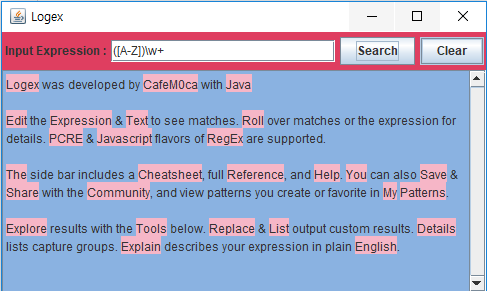

# Logex
Exercise regular expression in Localhost

## run powershell script
>> powershell -ExecutionPolicy ByPass -File .\compile.ps1 

## or
>> cmd >> java main

## or
>> $ java main

# Compile
>> javac main.java logex\*.java -encoding UTF-8

# Preview

# License
copyright(c)CafeM0ca 2018
MIT License 
